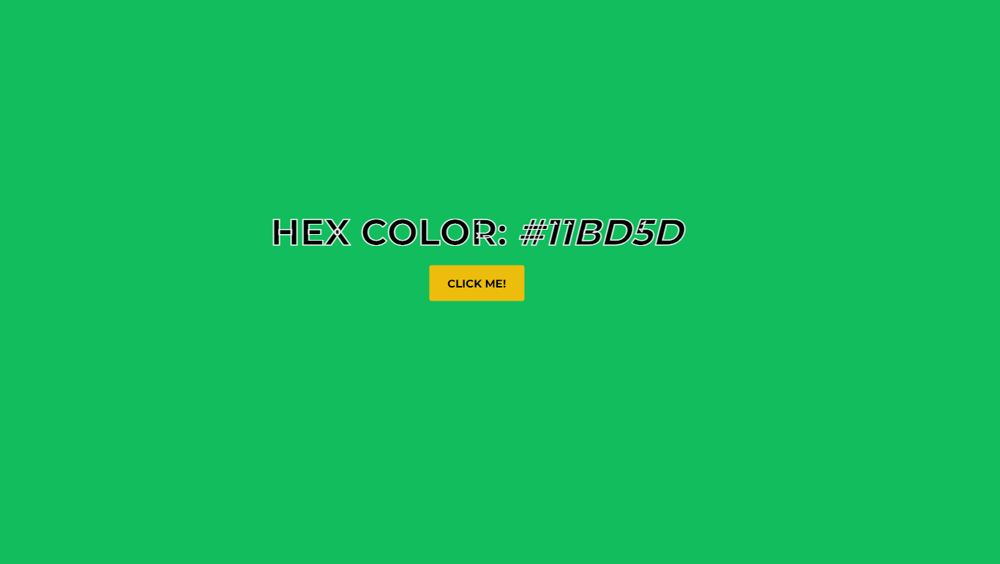

## Background Hex Changer
Clicking a button changes the background of the page to a random color and displays the hex value. Practicing was the main goal for the creation of this project.

## Technologies used
- HTML
- CSS
- JavaScript

## Quick preview
You can check out the app here:
<a href="https://dimitarradulov.github.io/background-hex-changer/" target="_blank">Background Hex Changer</a> 
(WARNING: Opens in the same tab)
